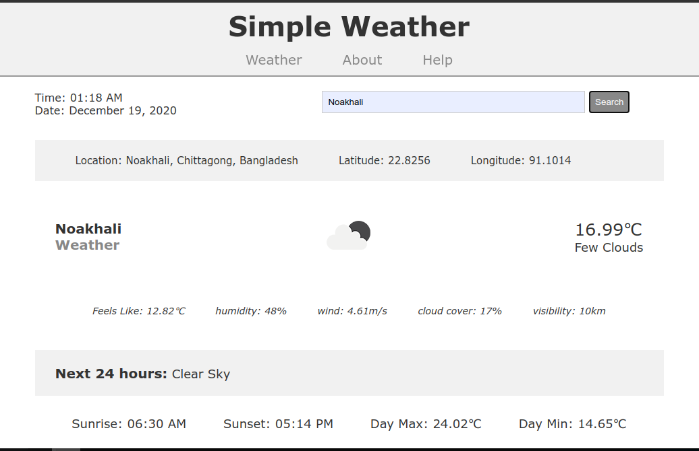

# Simple Weather App

A simple weather app built with Node JS. You can simply search with the location name to get the current weather information instantly.

LIVE LINK: [http://simp-weather.herokuapp.com/](http://simp-weather.herokuapp.com/)

**Screenshot**

   

## API's Used 

[OPEN Weather API](https://openweathermap.org/api) : to retrieve weather information

[MapBox Api](https://docs.mapbox.com/api/overview/) : to retrieve location latitude and longitude

